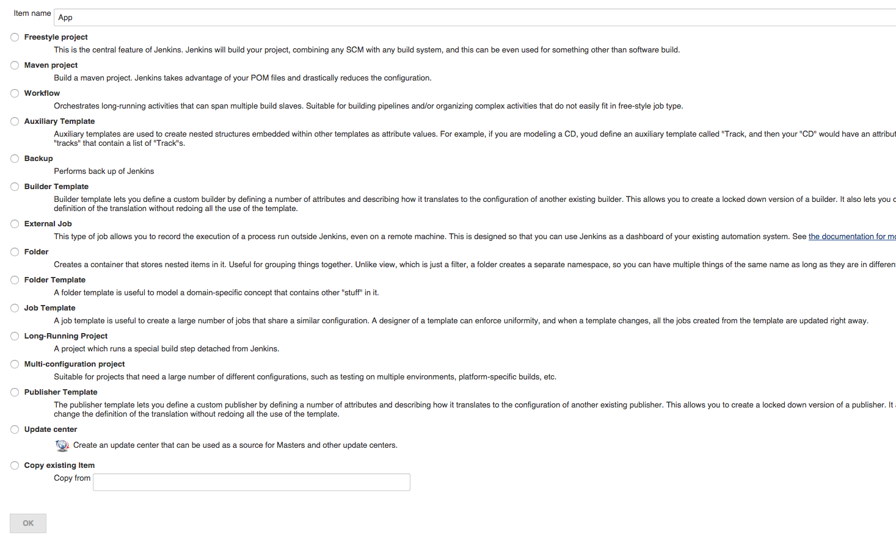
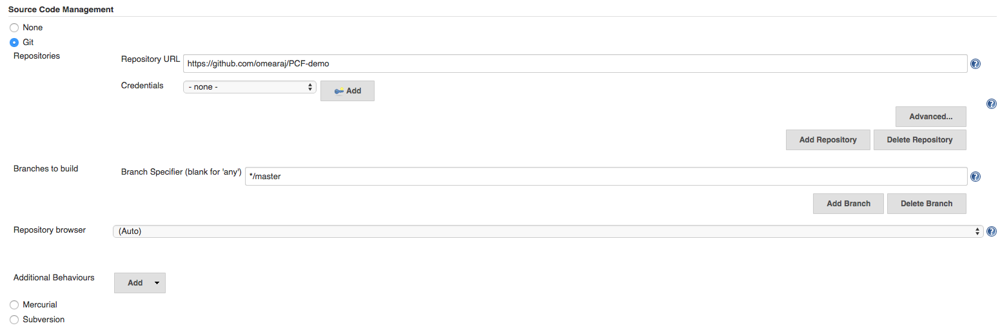
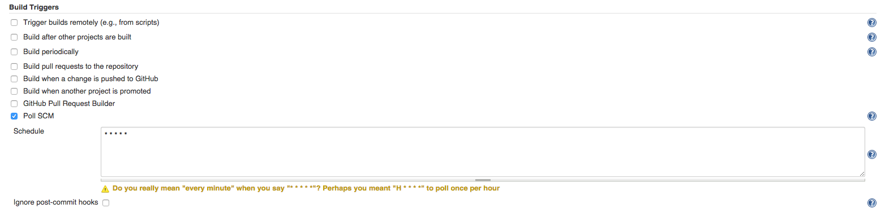
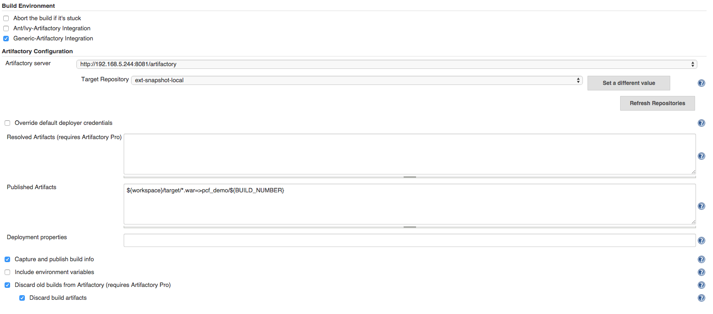
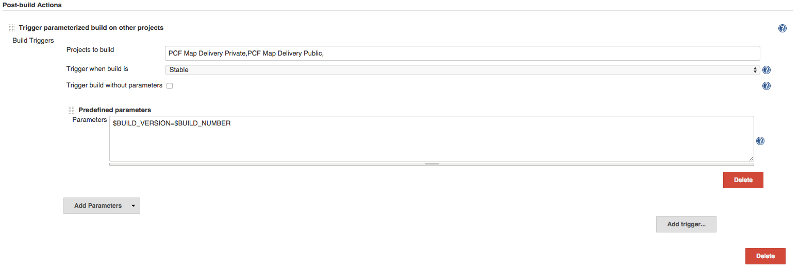
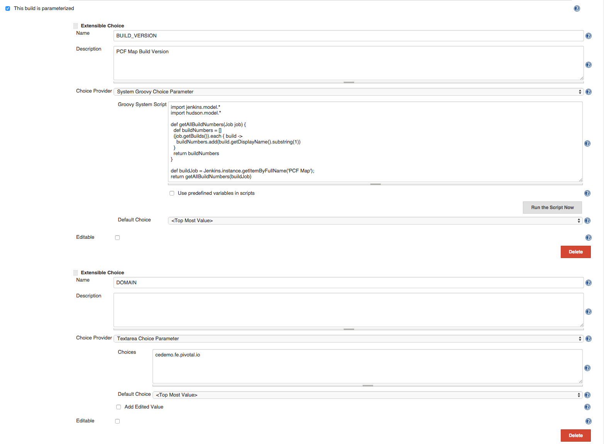
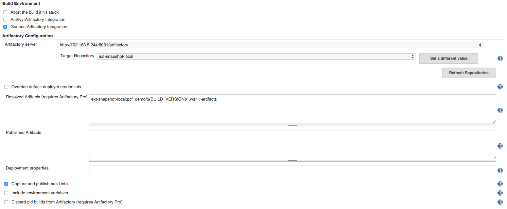
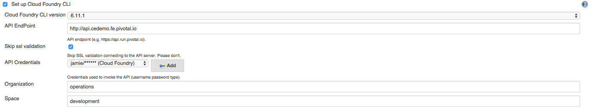

== Continuous Deployment

In this example we will create a continuous deployment pipleine using CloudBee's Jenkins, Artifactory and Pivotal Cloud Foundry

=== 1. Create Jenkins Job

Choose New Item and select FreeStyle project. Include a name for the project.

=== 2. Configure Source Code Management 

Choose Git and provide a public repo URL 

NOTE: private repos work assuming credentials are configured

=== 3. Set Build Trigger

In this example we'll to poll the repo for changes very frequently to watch the pipeline run.

=== 4. Build Environment

Set the build environment to use Generic-Artifactory integration. We'll use Artifactory as the true for our deployment 
artifacts. We also control the number of artifacts we keep by discarding old builds.

=== 5. Trigger Parameterized Deployment

Upon completiong the deployment artifact and storing it in Artifactory, we will call a downstream Jenkins job to deploy 
our application into our development environment in Pivotal Cloud Foundry. In this example we will call separate jobs 
to deploy into a on-premise and off-premise Cloud Foundry. 

We also pass and required parameters for downstream jobs, in this case the build number for the deployment artifact. You
can also use other deployment variables based on your design.

=== 6. Create a Deployment Job

The first Jenkin's job built and stored the deployment aritfact in Artifactory. This job leverages the CloudBee's CF CLI
to deploy our application into Pivotal Cloud Foundry. The job accepts a couple of parameters
. The Build Number from the previous upstream job.
. The domain name of the Cloud Foundry App Foundation.

The build number is used in the application name and route name when the application is pushed. This provides a quick way
to determine which build you are working with in the environment. You can use other identifiers from the build system like
hash commits for your design.

The domain name is provided to perform route maintenance in Cloud Foundry. When the application is pushed it is given a unique 
route in Cloud Foundry. This route is the mechanism for accessing the application, its the URL. In our example it follows
a naming convention of "map-build-XX.cedemo.fe.pivotal.io"

As a convenience, we also map a second route during deployment to the latest deployed artifact. The route in our example,
"map-dev.cedemo.fe.pivotal.io" makes it easy to always access the latest build in the development environment. Routes in 
Cloud Foudnry are very powerful and make the platfrom very easy to change.

=== 7. Retrieve Deployment Artifacts

Using the Artifactory integration we retrieve the deployment artifact for the requested build and store it in the workspace
of Jenkins.

=== 8. Configure Cloud Foundry Plugin

CloudBees's Jenkins provides a convenient Cloud Foundry plugin that can be used to integrate with Cloud Foundry. CloudBee's Jenkins
will manage the CLI version for you based on setting in the Jenkins configuration. To configure the plugin provide the following,

. Cloud Foundry API endpoint
. Credentials 
. Skip SSL Validation (This is based on SSL certifications in your Cloud Foundry Deployment).
. Organization
. Space

=== 9. Script of CF CLI Commands

Create a script to perform the required CF CLI commands to deploy your application. In our example we are deploying
to a development environment and are not concerned about performing a blue/green deployment. When we promote our code
from development to other environments we will perform a Blue/Green deployment ensuring continued service during our
upgrade.

In our example we complete the following steps,

. Determine the name of the deployed app. The naming convention for this app is map-build-BUILD_NUMBER, ex map-build-45. We assume only 1 previous build exist but this script can be modified to support multiple previous builds.

. If an app is found by querying the list of deployed apps then unmap a convenient url, ex map-dev.cfapps.io, and delete the existing app. In this situation we are ok with downtime as we deploy the new app in development.

note: route name must be unique in a foundation. If you use Pivotal Web Services you need to make sure your convenient URL is unique.

. Push the next released version, bind an existing Rabbit service to the app, map the convenient URL to the new 
instance and start the app.

. Log out

[source,bash]
----
APP_NAME=map-build-$BUILD_VERSION
HOST_NAME=$APP_NAME-dev
# assuming only 1 previous build.
DEPLOYED_APP_NAME=$(cf apps | grep 'map-build-' | cut -d" " -f1)
if [ -n "$DEPLOYED_APP_NAME" ]; then
  cf unmap-route $DEPLOYED_APP_NAME $DOMAIN -n map-dev
  cf delete $DEPLOYED_APP_NAME -f
fi
cf push $APP_NAME -p artifacts/pcfdemo.war -m 1GB -n $HOST_NAME -i 1 -t 180 --no-start
cf bind-service $APP_NAME myRabbit
cf map-route $APP_NAME $DOMAIN -n map-dev
cf start $APP_NAME
cf lo
----
