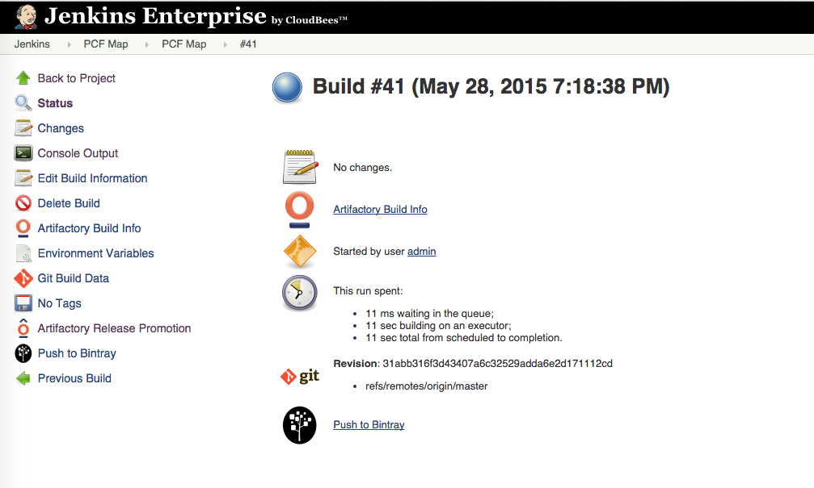
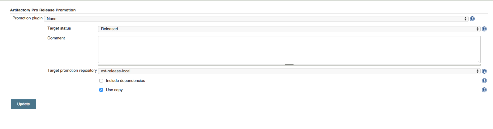
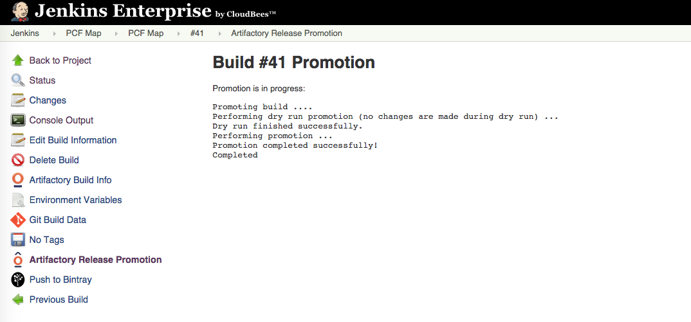
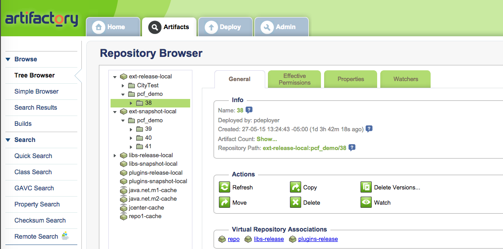
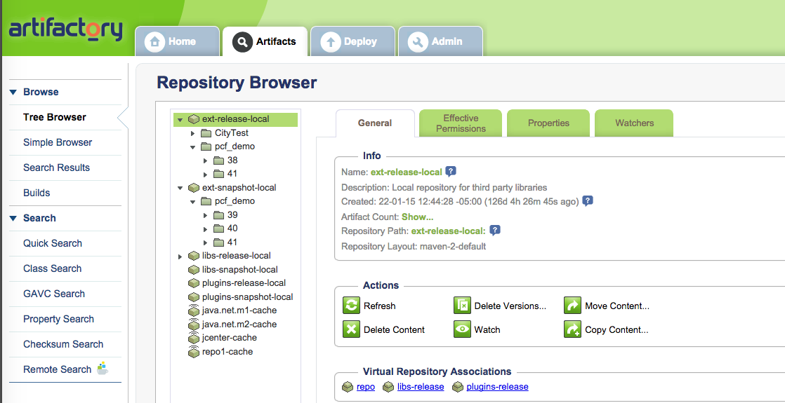
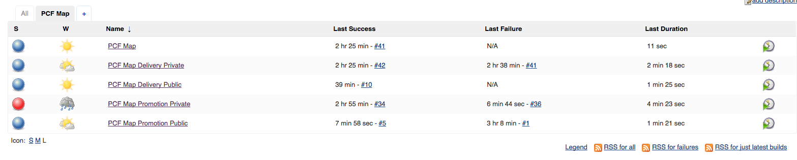
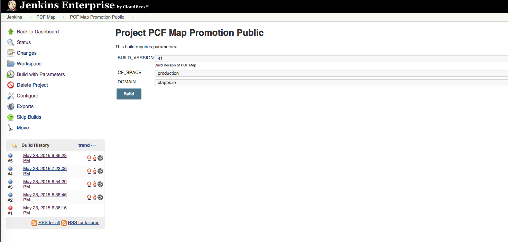

== Software Promotion

In this example we use the results from the continuous deployment pipeline to promote our software release to additional environments like test or production. In our design we encourage human interaction to complete the software promotion. We also use a Blue/Green deployment strategy to promote our software to validate testing and support rollback.

=== 1. Promote Software Release

Select the build Jenkins job, select the build version to promote and click on the "Artifactory Release Promotion" link 

=== 2. Promote Process

Select the target status and the target promotion library. You can also select to move a copy or the original.

Status of the promotion will be reported on the screen.

=== 3. Verify promotion status is Artifactory

Artifactory libraries before promotion.

Artifactory libraries after promotion. Notice a new copy under the "ext-release-local"

=== 4. Execute Blue/Green Deployment

Select the "PCF Map Promotion Public" Jenkins job to execute a Blue/Green deployment to the desired environment.

Select the desired space, CF_SPACE

[source:bash]
----
# ^^^^^^^^^^^^^^^^^^^^ Commands for Jenkins Script ^^^^^^^^^^^^^^^^^^^^^^^^^^^^^^^^^^^^^^^^

## These steps complete the following, they are the only required steps for the Jenkins Job
##
##   1. Determine the name of the deployed app. The naming convention for this
##      app is map-build-BUILD_NUMBER, ex map-build-45. We assume only 1 previous build
##      exist.
##
##   2. Push the promoted app to production and bind it to the required services, like Rabbit.
##      Map the external route name, maps in this case, to the production app
##
##   3. Scale down the existing version, unmap the external route and delete it.
##
##   Note: Best practice is to keep the previous version in case of roll back.
##
##   4. Log out
##

DEPLOYED_APP_NAME=$(cf apps | grep 'map-build-' | cut -d" " -f1)

cf push $APP_NAME -n $HOST_NAME -m 1GB -p artifacts/pcfdemo.war -t 180 -i 2 --no-start
cf bind-service $APP_NAME myRabbit
cf start $APP_NAME
cf map-route $APP_NAME $DOMAIN -n maps

#Perform Blue Green deployment
if [ ! -z "$DEPLOYED_APP_NAME" -a "$DEPLOYED_APP_NAME" != " " -a "$DEPLOYED_APP_NAME" != "$APP_NAME" ]; then
  echo "Performing zero-downtime cutover to $BUILD_VERSION"
  cf scale "$DEPLOYED_APP_NAME" -i 1
  cf unmap-route "$DEPLOYED_APP_NAME" $DOMAIN -n maps
  cf delete "$DEPLOYED_APP_NAME" -f -r
fi

cf lo
----
